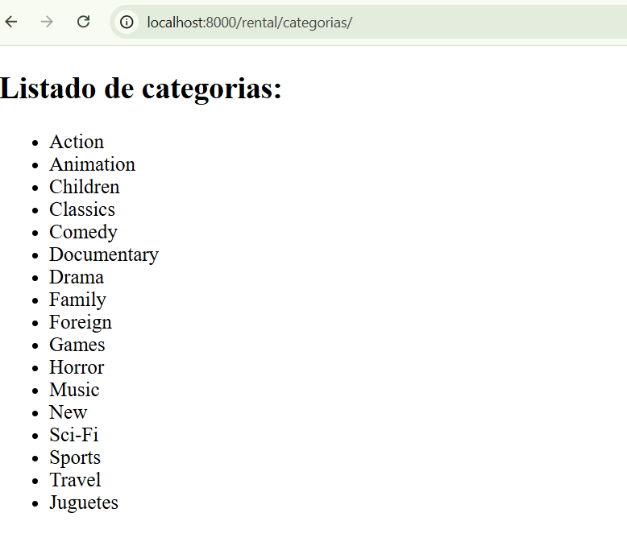

# PROYECTO PRUEBA DE CERTIFICACIÓN TD
<p>Prueba de certifación para Talento Digital</p>
<p>Nombre estudiante: ...</p>
<p>Curso: Python 0068</p>
<p>Correo: mi_correo@gmail.com</p>
<p>Contacto: +569....</p>

## RESTAURAR BASE DE DATOS
<ul>
    <li>Crear base de datos cin nombre ...</li>
    <li>Generar restauración desde archivo backup.tar</li>
    <li>Ubicación archivo backup en carpeta respaldo</li>
    <li>Verificar en settings.py que el usuario de contraseña de la conexión coincidan con los suyos.</li>
</ul>

Editar el siguiente código:
```
DATABASES = {
    "default": {
        "ENGINE": "django.db.backends.postgresql",
        "NAME": "dvderental",
        "USER": "<nombre usuario>",
        "PASSWORD": "<password>",
        "HOST": "127.0.0.1",
        "PORT": "5432",
    }
}

```

## INSTRUCCIONES PARA LEVANTAR PROYECTO
Instrucciones para levantar el proyecto

```
# Generar entorno virtual
python -m venv venv

# Instalar dependencias desde requirements.txt

pip install -r requirements.txt

# Levantar el proyecto

python manage.py runserver

```


## EVIDENCIAS

<h3>Evidencia listado de categorías</h3>



